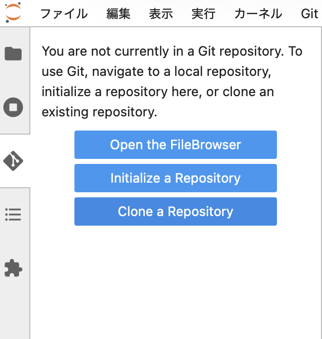

MSBBE211 データ可視化演習
=====================

Lecture 01: はじめに
-------------------

---

データの可視化とは
---------------

- 単なる数字や文字列の羅列(もっと言えば2進数の集合)であるデータを可視化することで、そのデータの意味を理解することができる。
- AIをはじめとする機械学習では機械的に膨大なデータを処理することも多いが、データの意味を理解した上で処理を行うことが重要です。
- プレゼンや論文で成果や結果を示すときには、他人が理解できるデータ表示方法が必要。(自分だけが理解できるものはだめ。)

---

授業の目的
--------

以下の内容を理解・修得する。

- データ分析の方法
- データの表示方法
- データを可視化する意義
- データサイエンスの基礎技術

---

授業の進め方
----------

- 前半は講義で、その日の内容を説明します。
- 後半は演習で、講義の内容を含めて演習課題を解きます。
- 講義ノートとハンズオン内容、演習課題についてはGitHubで提示します。
- 演習課題はmanabaで提出します。
- 演習課題は原則授業内で完成させます。
- できなかった分は宿題になります。 (ペナルティあり。)
- 期末定期試験、授業内試験はなし。(毎回の課題が全てです。)

---

「演習」の授業について
-----------------

- 演習科目は15回の授業で1単位となります。
- (予習0.5時間 + **授業2.5時間** + 復習0.5時間) × 14回 = 49時間。
- つまり、授業への出席し、演習を行うことが単位要件のすべてとなります。
- 同様の理由で30分以上の遅刻はすべて欠席扱いとします。(ビーコンによる出席登録を記録します。)
- 遅刻・欠席は3回までで、4回以上の時点で **不合格(N判定)** とします。
- 出席不良者に対する**救済措置はありません**。

---

GitHubについて
-------------

- この授業では、GitHubの仕組みを使って教材資料の配布を行います。
- Gitはオープンソース(Linux)のバージョン管理のために作られたツールで、GitHubはそれをクラウド上で共有する仕組みです。
- ソフトウェア開発者同士がGitHub上でソースコードを共有することで、効率の良い共同作業を行うことができます。
- まともな会社ではGitHub(と同等のツール)を使って開発しているので、将来、エンジニアとして働く人は使い方を学んで損はありません。
- 授業のノートやメモもGitHubで管理すれば超便利。

---

JupyterLab学習システムについて
---------------------------

- 以下のURLからJupyterLabの学習システムにログインします (システムは11号館1階のサーバー室内にあります)

    https://jupyter-gpu.meijigakuin.ac.jp

- 左にあるGitのボタンから`Clone a Repository`を選択し、以下のURLを入力して`Clone`ボタンを押します

https://github.com/kohta-MGU/2026_DataVisualization.git

---

manabaからの提出
--------------

- 作成した課題(Exerciseファイル)は右クリックでダウンロードして、manabaのレポート機能を使って添付ファイルとして提出します

---

演習01
-----

1. JupyterLabのシステムにログインする。
2. GitHubから授業資料と課題ファイルをcloneする。
3. Jupyter Notebookを編集し、mababaでレポート課題としてを提出する。

---

発展
---

- 余力がある人は、ローカルマシンにインストールしたPythonを使って実習環境を構築する(「初級プログラミング」ですでにできているはず)
- Visual Studio CodeからもGitHubのレポジトリをcloneして編集、実行できる。
